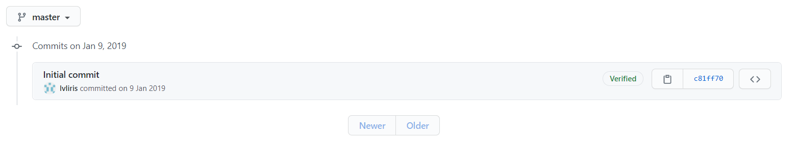

# My Love Story
哈哈，我准备了一个小游戏，你能通过给出的线索，一步步找到隐藏在代码库中的信息吗？  
准备好了吗？Let's Go!!!
- 线索1  
先别急着翻代码，看看历史提交记录里的commit message里的信息。  
找到如下页面  

也就是[这里](https://github.com/lvliris/MyLoveStory/commits/master)
- 线索2  
仔细看看commit message的内容，**提交日期**也很重要哦  
- 线索3  
试着运行一下`schedule.py`这个脚本，或者没有运行环境就只能在脑子里跑啦，又或者你可以跳过这条
- 线索4  
**提交日期**太多看不过来？其实github已经帮你整理好啦  
找到如下页面

也就是 [这里](https://github.com/lvliris)  
---
啊，华生，你发现了盲点！！！  
所以你的回答是...